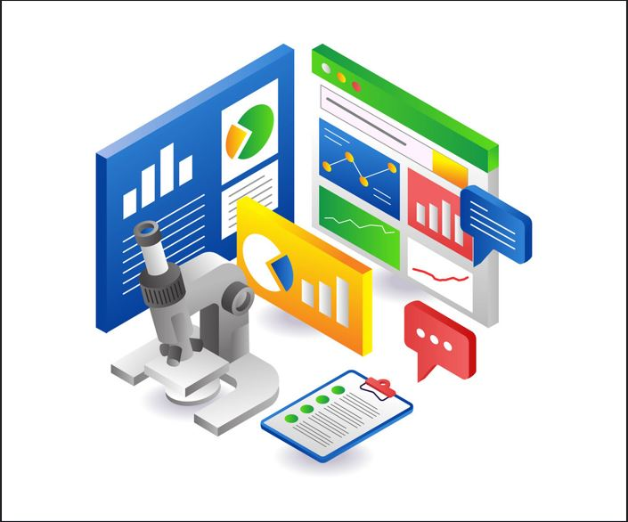

# HR-Data-Documentation

- These the comprehensive documention of the HR data which contains information of staffs in an organization.

---
## Project Overview
The HR Data is a record of survey taken by members of staffs in an organization, this data consist of staff age range,staff Attrition,department, job level,job satisfaction, monthly income and educationallevel just to mention a few. 
In this project i seek to know the root cause of the high attrition rate, factors contributing to the attrition rate and the correlation between attrition and some other factors that may be influencing the exit of staffs in the company.
 
---
## Project Outline
- HR-Data-Documentation [HR Data Documentation](#hr-data-documentation)
- Project Overview [Project Overview](#project-overview)
- Data Source [Data Source](#data-source)
- Tools Used  [Tools Used](#tools-used)
- Data cleaning [Data cleaning](#data-cleaning)
- Data Analysis [Data Analysis](#data-analysis)
- Conclusion and Findings [Conclusion and Findings](#conclusion-and-findings)

---

## Data Source 
The source of the HR data used in this Analysis is from skilhavest practical class  [ClICK HERE TO DOWNLOAD](https://tinyurl.com/2udjsy98) 

---

## Tools Used 
 tool used for both the Analysis and Visulaisation of the above data Includes 
- PowerBI
- Power Query
- Google sheet [click Here To View](https://tinyurl.com/2udjsy98)
---
## Data cleaning 
In a bid to clean the data for onward use, some basic operations were carried out on the data before use

- Promotion of row header: The first roll was promoted to make up for the header which was not indicated in the raw data
- Change data type : The data types of some certain columns were changed from the the default starng values to Numbers
- Addition of conditional columns: In other to effectively sort the age range colunm in chronological other during the analysis a 
  conditional column was created. 
---
## Data Analysis
The data used in this analysis has been partially cleaned, in my analysis i tried to first find the total number of employees in the company then i proceeded to get the number of retained staffs, i was also able to get the attriion count then from the attrition count and number of employee i calculated the rate of attrition in the organization and also find the average age of employee in the organization. 

The number of retained staff was calaculated using the DAX function
```
Retained Staff = sum('HR data'[Employee Count])-sum('HR data'[Attrition Count])
```
The rate of attrition was calculated using the DAX function 
```
Attrition Rate = sum('HR data'[Attrition Count])/sum('HR data'[Employee Count])
```
- I tried to check for job satisfaction by job role and attrition count by department
- I also tried to see the correlation of attrition by education and marital status
- I also compared between atrrition, education and gender
- I also made comparison between attrition, age band and Gender
---

Findin
