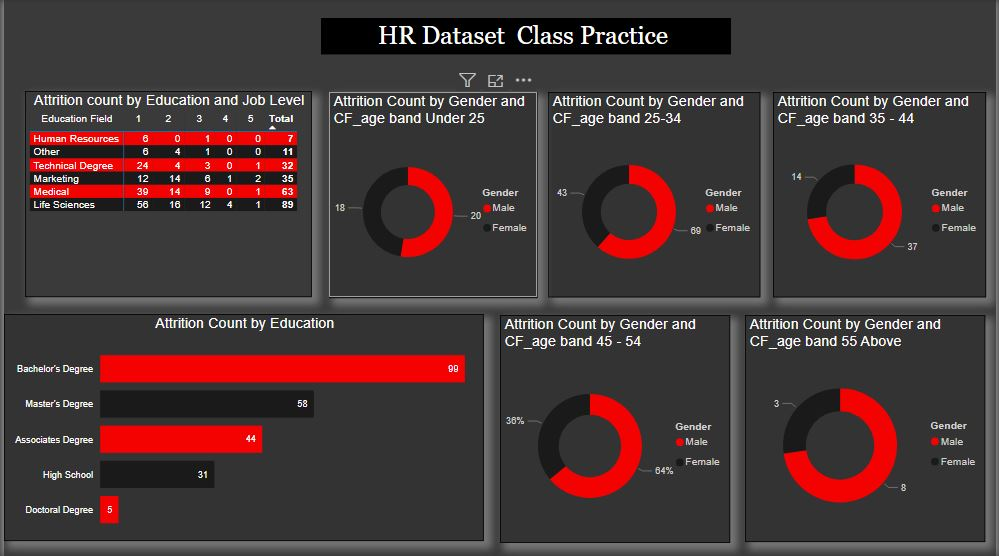

# HR-Data-Documentation

- These are the comprehensive documentation of the HR data which contains information on staff in an organization.

---
## Project Overview
The HR Data is a record of a survey taken by staff members in an organization, this data consists of staff age range, staff Attrition, department, job level, job satisfaction, monthly income, and educational level to mention a few. 
In this project, I seek to know the root cause of the high attrition rate, the factors contributing to the attrition rate, and the correlation between attrition and some other factors that may be influencing the exit of staff in the company.
 
---
## Project Outline
- HR-Data-Documentation [HR Data Documentation](#hr-data-documentation)
- Project Overview [Project Overview](#project-overview)
- Data Source [Data Source](#data-source)
- Tools Used  [Tools Used](#tools-used)
- Data cleaning [Data cleaning](#data-cleaning)
- Data Analysis [Data Analysis](#data-analysis)
- Findings And Conclusion [Findings And Conclusion](#findings-and-conclusion)

---

## Data Source 
The source of the HR data used in this Analysis is from skilhavest practical class  [ClICK HERE TO DOWNLOAD](https://tinyurl.com/2udjsy98) 

---

## Tools Used 
 tool used for both the Analysis and Visualization of the above data Includes 
- PowerBI
- Power Query
- Google sheet [click Here To View](https://tinyurl.com/2udjsy98)
---
## Data cleaning 
In a bid to clean the data for onward use, some basic operations were carried out on the data before use

- Promotion of row header: The first roll was promoted to make up for the header which was not indicated in the raw data
- Change data type: The data types of some certain columns were changed from the default string values to Numbers
- Addition of conditional columns: To effectively sort the age range column in chronological order during the analysis a
  conditional column was created. 
---
## Data Analysis
The data used in this analysis has been partially cleaned, in my analysis I tried to first find the total number of employees in the company then I proceeded to get the number of retained staff, I was also able to get the attrition count then from the attrition count and number of employee i calculated the rate of attrition in the organization and also find the average age of an employee in the organization. 

The number of retained staff was calculated using the DAX function
```
Retained Staff = sum('HR data'[Employee Count])-sum('HR data'[Attrition Count])
```
The rate of attrition was calculated using the DAX function 
```
Attrition Rate = sum('HR data'[Attrition Count])/sum('HR data'[Employee Count])
```
- I tried to check for job satisfaction by job role and attrition count by department
- I also tried to see the correlation between attrition by education and marital status
- I tried to see the relationship between attrition, education, and gender 
- And the relationship between attrition, age band, and Gender
---

## Findings And Conclusion
The dashboard below shows the results of the analysis carried out on the HR data.
- From  the dashboard, we have a total of 1470 total employees and 1233 retained employees. Also, we have a total of 237 attrition which accounted for the 16% attrition rate 
  and an average age of 37 years.
- The following was deduced from the analysis as shown on the dashboard using a pie chart of the attrition count by the department the R&D department with 133 employees 
  attrition and the sales department coming second with 92 employees while the HR has the least number with just 12 employees.
- The attrition count by Education and Gender shows that more males are leaving the organization coupled with the fact that there are more of these males with advanced 
  degrees than their female counterparts This may be attributed to the need to get a better offer in other to prepare for the future(starting a family) standard of leaving.
- On the attrition count by age grade and gender, we have employees from the age bracket 25 - 34 who are Males leaving the organization, this could also be attributed to the 
  fact that young adults who are low-income earners in the organization and who have hopes of getting a better offer would prefer to look else where they feel satisfied with 
  the work environment, work conditions as well as the salary.
- For the attrition count by education and marital status, we have more singles who own bachelor's degrees leaving the organization and those with a doctoral degree being 
  the least as it is easier for the single unmarried with fewer responsibilities to shuffle between jobs and explore than it is for those who already have responsibilities
- For the Job role by Satisfaction we can see from the matrix which shows the satisfaction of employees in relation to their job role that those with job roles like the 
  research director are  more satisfied reason could be good pay, less pressure with only two unsatisfied employees. The same can not be said for the laboratory Technicians,   as it seems they are less satisfied with their jobs as we see from the chat, the role has a total of 62 employees and following closely is the sales executives which has     57 employees, the research scientist with 47 employees and then the sales representative with 33 employees the reason for this unsatisfaction in a work environment could     be attributed to so many conditions like, too much pressure, unbalanced work life, poor pay and so on.
  



